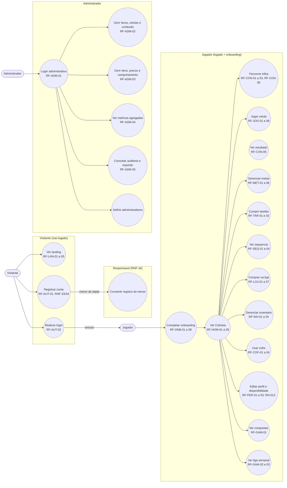
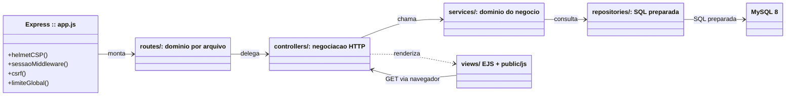
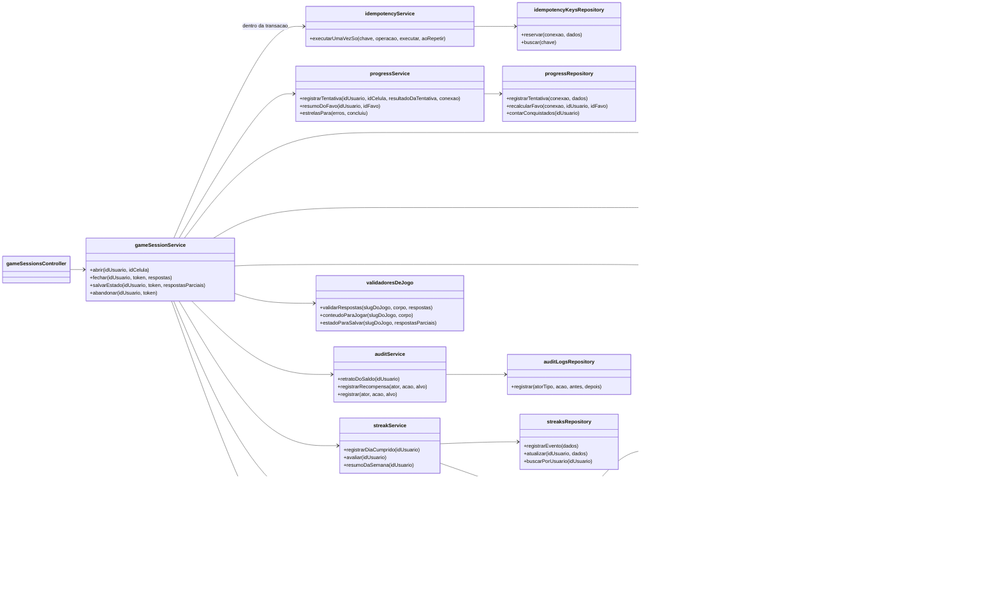
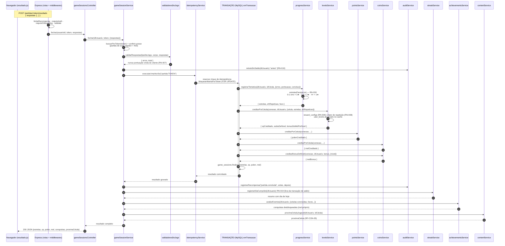

# Diagramas do TCC (T-15.2)

Os quatro diagramas pedidos na T-15.2 do roadmap: **ER**, **casos de uso**,
**classes** e **sequência do fluxo de recompensa**. Todos são Mermaid e
renderizam direto no GitHub — é só abrir este arquivo lá para ver as figuras.

O ponto de partida é a rastreabilidade: cada figura tem a referência do
requisito que representa (`docs/01-REQUISITOS-E-REGRAS.md`), o arquivo de
código que a sustenta e o laudo que a provou, alinhado ao que
`docs/RASTREABILIDADE.md` já diz.

---

## 1. Diagrama de entidades e relacionamentos (ER)

O DDL é a verdade e está em `migrations/` (23 arquivos, 60 tabelas; a 61ª é
`schema_migrations`, criada pelo próprio runner). A versão
detalhada — área por área, com as colunas que explicam cada ligação — está em
`docs/MODELO-DE-DADOS.md`. A figura abaixo é o **mapa inteiro do banco em uma
só visão**: basta para situar qualquer tabela no contexto do jogo, e a
rastreabilidade regra → tabela está na seção 9 do documento de modelo.

As seis áreas de `docs/MODELO-DE-DADOS.md` aparecem aqui agrupadas:
contas (1), trilha (2), recompensas (3), metas e sequência (4), economia (5)
e auditoria/gamificação (6).

```mermaid
erDiagram
    %% ============ 1. CONTAS ============
    users ||--o| profiles : "1:1 (RN-050)"
    users ||--o| admins : "join (RN-051)"
    users ||--o{ guardian_consents : "RNF-34"
    users ||--o{ schedules : "RN-011"
    age_bands ||--o{ profiles : classifica
    avatars ||--o{ profiles : veste
    initial_goals ||--o{ profiles : motiva
    %% sessions guarda a sessao de login do express-session: sem FK de proposito
    sessions { varchar session_id PK }

    %% ============ 2. TRILHA ============
    age_bands ||--o{ hives : segmenta
    hives ||--o{ cells : contem
    game_types ||--o{ cells : define_jogo
    cells ||--o{ contents : carrega
    items ||--o{ hives : pode_desbloquear
    users ||--o{ cell_progress : avanca
    cells ||--o{ cell_progress : registra
    users ||--o{ hive_progress : acumula
    hives ||--o{ hive_progress : resume

    %% ============ 3. RECOMPENSAS ============
    users ||--|| wallets : "livro x cache"
    users ||--|| user_levels : "livro x cache"
    levels ||--o{ user_levels : define_curva
    game_types ||--o{ reward_configs : precifica
    age_bands ||--o{ reward_configs : ajusta
    %% reward_modifiers e catalogo de fatores lido junto de reward_configs (RN-008)
    reward_modifiers { bigint id PK }
    users ||--o{ game_sessions : joga
    cells ||--o{ game_sessions : e_jogada_em
    game_session_statuses ||--o{ game_sessions : estado
    users ||--o{ xp_ledger : acumula
    users ||--o{ point_ledger : acumula
    users ||--o{ coin_ledger : movimenta
    reward_reasons ||--o{ xp_ledger : justifica
    reward_reasons ||--o{ point_ledger : justifica
    reward_reasons ||--o{ coin_ledger : justifica
    users ||--o{ idempotency_keys : protege

    %% ============ 4. METAS E SEQUENCIA ============
    users ||--o{ goals : persegue
    goal_types ||--o{ goals : tipifica
    goal_statuses ||--o{ goals : estado
    goal_difficulties ||--o{ goals : calibra
    goal_difficulties ||--o{ goal_plan_rules : quantas_metas
    goal_types ||--o{ goal_target_rules : dimensiona_alvo
    goals ||--o{ goals : renova
    users ||--o{ tasks : cumpre
    task_types ||--o{ tasks : tipifica
    task_scopes ||--o{ task_types : escopo
    goal_statuses ||--o{ tasks : estado
    users ||--|| streaks : mantem
    users ||--o{ streak_events : registra
    streak_event_types ||--o{ streak_events : classifica

    %% ============ 5. ECONOMIA ============
    item_categories ||--o{ items : agrupa
    items ||--o{ item_behaviors_map : combina
    item_behaviors ||--o{ item_behaviors_map : compoe
    items ||--o{ item_requirements : exige
    item_requirement_types ||--o{ item_requirements : tipifica
    items ||--o{ items : upgrade_de
    vault_transaction_types ||--o{ vault_transactions : tipifica
    users ||--o{ purchases : compra
    items ||--o{ purchases : e_comprado
    purchases ||--o| inventory : origina
    users ||--o{ inventory : possui
    inventory_statuses ||--o{ inventory : estado
    users ||--|| vaults : poupa
    users ||--o{ vault_transactions : movimenta
    users ||--o{ economic_cycles : processa
    users ||--o{ patrimony_snapshots : fotografa

    %% ============ 6. AUDITORIA E GAMIFICACAO ============
    audit_actor_types ||--o{ audit_logs : quem
    achievements ||--o{ user_achievements : premia
    users ||--o{ user_achievements : desbloqueia
    leagues ||--o{ league_members : classifica
    users ||--o{ league_members : disputa
    league_prizes ||--o{ league_members : paga

    users { bigint id PK }
    hives { bigint id PK }
    cells { bigint id PK }
    game_sessions { bigint id PK }
    goals { bigint id PK }
    tasks { bigint id PK }
    items { bigint id PK }
    purchases { bigint id PK }
    inventory { bigint id PK }
    vaults { bigint id PK }
    vault_transactions { bigint id PK }
    audit_logs { bigint id PK }
    user_achievements { bigint id PK }
    league_members { bigint id PK }
    league_prizes { smallint final_rank PK }
```

Três decisões que este diagrama reflete e que são os argumentos do TCC:

1. **Livro em vez de saldo** (`xp_ledger`, `point_ledger`, `coin_ledger`):
   saldo em `wallets` e `user_levels` é cache, reconciliado por
   `npm run db:reconcile`. É o que prova como a criança chegou ao saldo
   (RN-001, RN-010).
2. **Enum é tabela** (`game_types`, `goal_types`, `reward_reasons`,
   `audit_actor_types`, `inventory_statuses`, ...): acrescentar tipo ou estado
   é `INSERT`, nunca migration destrutiva.
3. **A regra mora no banco quando dá**: `CHECK` e `UNIQUE` barram mel
   negativo, token repetido, XP negativo e estrela fora de 0–3 (seção 7 de
   `docs/MODELO-DE-DADOS.md`).

As migrations portarão as colunas completas: a `022` deu a `achievements` o
`criterion_type`/`criterion_target`, e a `023` criou `league_prizes` e trocou a
unicidade de `leagues` para o par `(starts_on, name)`.

---

## 2. Diagrama de casos de uso

Atores extraídos da visão de produto (`docs/01-...` seção 1) e das rotas reais
(`src/routes/`). "Responsável" não tem conta própria no MVP — participa pelo
consentimento no registro (RNF-34) e pelas seções de pais da landing; por isso
aparece com participação pontual.

Cada caso mapeia um grupo de requisitos funcionais. A numeração abaixo é a da
tabela de RFs, para a rastreabilidade fechar sem página nova.

Observações de fidelidade ao código:

- **Não existe caso de uso "criar meta" nem "criar tarefa" para o jogador.**
  Meta nasce da disponibilidade no onboarding (RF-MET-01, RN-014) e tarefa é
  proposta pelo servidor na entrada — as rotas `/metas` e `/tarefas` só listam e
  concluem. A ausência é o desenho, não esquecimento.
- **Não há caixa onde "Responsável" pula por cima do login**: o consentimento é
  capturado no cadastro (e-mail + checkbox), e o painel do responsável é P2,
  só modelado no banco.
- **RF-GAM-01 (conquistas) desbloqueia sozinha por evento** — célula concluída
  na partida, metas batidas, patrimônio, sequência e cofre —, então não é um
  "obter conquista" manual; é acompanhamento (j13).

---

## 3. Diagrama de classes

O Beever é JavaScript puro em módulos ES, sem POO clássica. O "diagrama de
classes" do TCC mostra, então, as **camadas e seus módulos** — a visão que a
RNF-27 (`docs/01-...` seção 5.5) descreve: rotas → controllers → services →
repositories → MySQL, com a regra de que **nenhuma SQL existe fora de
repository**.

Figura 3a — arquitetura em camadas:

Figura 3b — as classes centrais do fluxo de recompensa, com os métodos públicos
que a figura de sequência (seção 4) usa. É o coração do sistema: a linha
partida → progresso → XP/pólen/mel → saldo → auditoria.

Regra de ouro que este diagrama protege: os services de saldo **recebem a
conexão da transação** de quem os chama (`gameSessionService.fechar`), e os que
podem chamar `walletsRepository`/`userLevelsRepository` são exatamente os três
de recompensa (XP, pólen, mel) mais a auditoria — nada além deles toca saldo
(RN-001 a RN-010, RNF-15).

---

## 4. Diagrama de sequência do fluxo de recompensa

O fluxo mais importante do jogo, e o que o TCC precisa demonstrar como à prova
de fraude (RN-007, RN-009, RNF-15 a RNF-17). Partida fechada pelo navegador →
resposta validada contra o gabarito do banco → três recompensas na mesma
transação → auditoria → sequência → conquistas.

Código: `src/routes/partidas.js`, `src/controllers/gameSessionsController.js`,
`src/services/gameSessionService.js` (e deps). Caminho no laudo
`docs/06-AUDITORIA-DA-ETAPA.md` e no contrato `docs/CONTRATO-DE-JOGO.md`.

O que este fluxo prova, e que a figura deixa explícito:

1. **RN-007 (cálculo no servidor):** o único número que o navegador manda é a
   lista de respostas; erros e estrelas saem do gabarito do banco em
   `validadoresDeJogo`. Não há pontuação aceita na entrada da rota.
2. **RN-009 / RNF-16 (idempotência):** a chave é o próprio token da partida.
   `idempotencyService.executarUmaVezSo` reserva a chave na mesma transação do
   crédito; reenvio de resposta (conexão ruim, duplo clique) devolve o
   resultado gravado sem creditar de novo.
3. **RNF-15 (transação):** XP, pólen, mel e o bônus de nível caem juntos ou não
   caem (`emTransacao`). Uma partida que credita XP e falha no mel não existe.
4. **RN-010 / RNF-17 (auditoria):** retrato antes (lido fora da transação) e
   depois (lido de dentro), uma linha por partida, e falha de auditoria nunca
   desfaz o mel pago.
5. **Fora da transação de saldo:** sequência (falha não desfaz o crédito) e
   conquistas (pagas em transação própria, UNIQUE do banco impede pagar dois
   marcos). Essa separação é a mesma que `docs/06-AUDITORIA-DA-ETAPA.md`
   descreve.

---

## Como as figuras se provam

| Diagrama | Fonte da verdade | Requisitos | Teste que sustenta |
|---|---|---|---|
| ER | `migrations/` (23 arquivos) | RN-001 a 053 | `test/integration/repositories/*`; `npm run db:reconcile` |
| Casos de uso | `src/routes/` + `docs/01-...` | RF-AUT a RF-LAN | `test/integration/*` (rotas reais por HTTP) |
| Classes | `src/services/`, `src/repositories/` | RNF-27 | `npm run test:cobertura` (100% linha nos services de cálculo) |
| Sequência | `src/services/gameSessionService.js` | RN-007/009/010, RNF-15/16/17 | `sessaoDeJogo.test.js`, `idempotencia.test.js` |