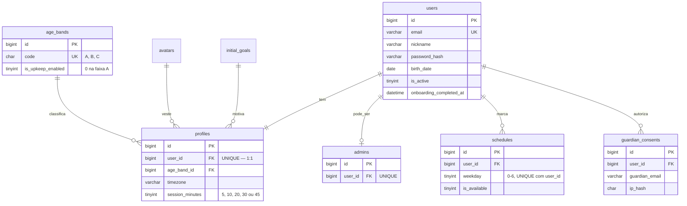
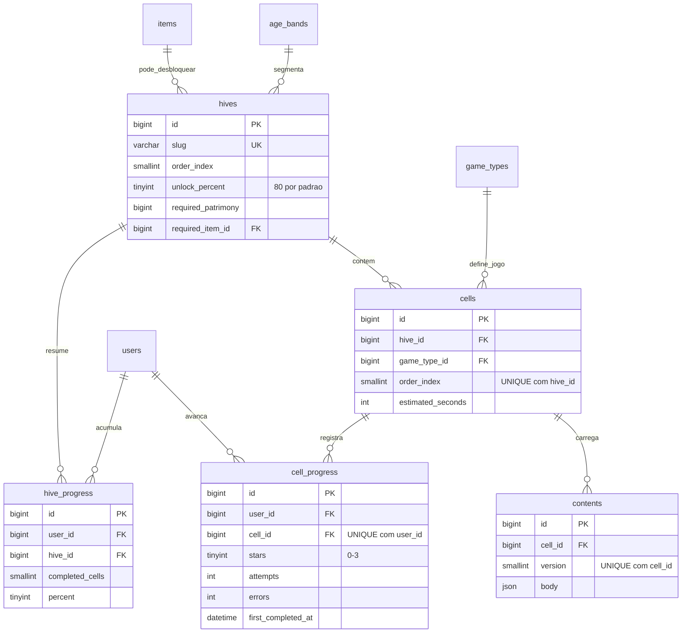
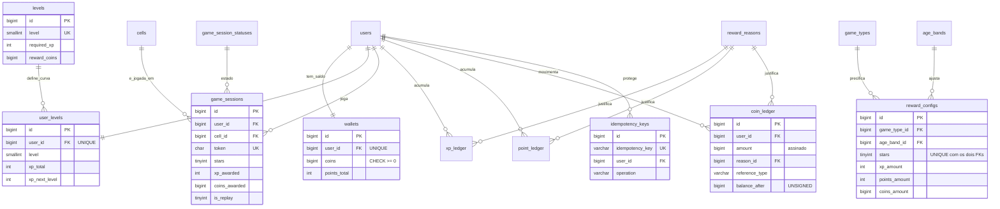
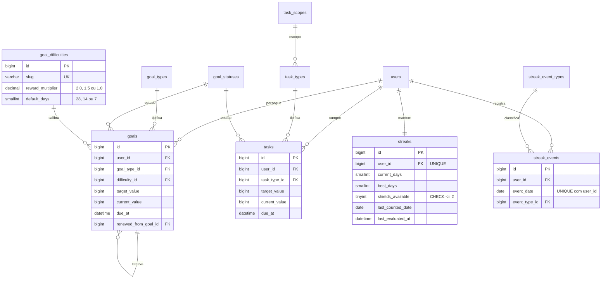
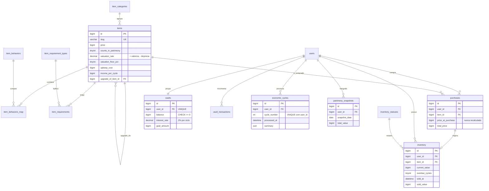
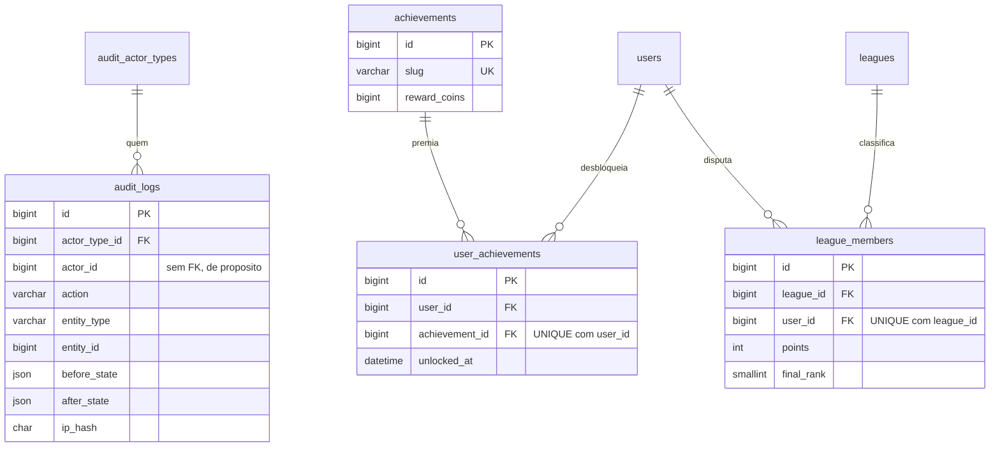

# Modelo de dados

Referência do banco do Beever: o que cada tabela guarda, qual regra de negócio a
obriga a existir e o que o banco garante sozinho. O DDL é a verdade e está em
`migrations/`; este documento explica o porquê.

Etapa E01 · 56 tabelas · 67 foreign keys · 39 `CHECK` · 43 `UNIQUE`

---

## Resumo em 2 minutos

O modelo tem seis áreas: **contas**, **trilha**, **recompensas**, **metas e
sequência**, **economia** e **auditoria**. Uma migration por área, na ordem em
que as dependências exigem.

Três decisões explicam quase todo o resto:

1. **Livro em vez de coluna de saldo.** Mel, pólen e XP têm cada um o seu livro
   append-only. `wallets` e `user_levels` são cache, atualizados na mesma
   transação. Com uma coluna só seria impossível provar como a criança chegou ao
   saldo — que é justamente o que a auditoria do TCC precisa demonstrar.
   `npm run db:reconcile` compara os dois lados.
2. **Enum é tabela.** Nenhum estado, tipo ou comportamento é `ENUM` de coluna.
   Acrescentar um jogo novo, um tipo de meta ou um comportamento econômico é
   `INSERT`, não migration destrutiva.
3. **A regra mora no banco quando dá.** Saldo negativo, token de sessão
   repetido, ciclo econômico aplicado duas vezes, estrelas fora de 0–3 e total
   de compra inconsistente são rejeitados pelo MySQL, não pelo service. Se a
   integridade depende só da aplicação, o modelo está incompleto.

**Dinheiro é `BIGINT` em unidades inteiras de mel. Nunca ponto flutuante** — não
existe uma única coluna `FLOAT` ou `DOUBLE` no banco. XP e pólen são
`INT UNSIGNED`; taxas são `DECIMAL(6,3)`.

**Datas são `DATETIME` em UTC.** O fuso do jogador fica em `profiles.timezone`,
porque a virada do dia da sequência (RN-024) precisa acontecer no fuso dele, não
no do servidor.

---

## Convenções

As mesmas de `docs/03-BANCO-DE-DADOS-DBA.md`, seção 3, repetidas em
`migrations/README.md`. Em resumo: InnoDB, `utf8mb4_0900_ai_ci`, tabela em
`snake_case` plural, PK `id BIGINT UNSIGNED`, FK `<entidade_singular>_id`,
booleano com prefixo `is_`/`has_`, `created_at` e `updated_at` em toda tabela de
negócio, `ON DELETE` explícito em toda FK.

Como ler os diagramas: só as colunas que importam para entender a ligação estão
listadas. O conjunto completo está no `CREATE TABLE` de cada migration.

---

## 1. Contas e perfis

`migrations/001_core_users.sql`



| Tabela | Existe porque | Regra |
|---|---|---|
| `users` | Conta de acesso. **Não guarda nome completo, endereço nem foto** — apelido e avatar bastam | RN-049 |
| `profiles` | Preferências do jogador, 1:1 com a conta, garantido por `UNIQUE(user_id)` | RN-050 |
| `admins` | Administrador é tabela e join, **nunca** coluna de papel no usuário | RN-051 |
| `age_bands` | A faixa decide dificuldade, conteúdo visível e quais mecânicas econômicas ligam. Na faixa A, custo fixo e depreciação ficam desligados | RN-029, RN-038 |
| `schedules` | Os dias marcados no onboarding decidem quantas metas o planner gera. `UNIQUE(user_id, weekday)` impede o mesmo dia duas vezes | RN-011, RN-014 |
| `guardian_consents` | Consentimento do responsável, com hash do IP em vez do IP em claro | RNF-34 |
| `sessions` | Store do `express-session`. Segue o formato da biblioteca, fora das convenções de propósito. **Nome distinto de `game_sessions`** | — |

`avatars` e `initial_goals` são catálogos: o dump antigo guardava avatar como
caminho de arquivo em texto livre e objetivo como texto solto.

---

## 2. Trilha: favos, células e progresso

`migrations/002_content_hives_cells.sql`



| Tabela | Existe porque | Regra |
|---|---|---|
| `hives` | Favo é o módulo da trilha. Libera o seguinte com `unlock_percent` do atual, e pode exigir patrimônio ou um item específico | RN-025, RN-027, RN-028 |
| `cells` | Célula é a atividade. `UNIQUE(hive_id, order_index)` é o que torna "a próxima célula" uma pergunta com resposta única | RN-026 |
| `contents` | Payload do jogo em JSON com `version`. O banco garante JSON válido e a ligação com a célula; o formato interno é validado pela aplicação | decisão do checkpoint da E01 |
| `cell_progress` | `UNIQUE(user_id, cell_id)` é o que torna repetição detectável: linha existente significa refazer, que vale 25% de XP e zero mel | RN-008, RN-030 |
| `hive_progress` | Cache do percentual por favo. Desnormalização deliberada: recontar células a cada carregamento da Colmeia seria N+1 na página mais visitada | RNF-04 |

**Sem sistema de vidas.** A avaliação é por estrelas — 3 (0–1 erro), 2 (2–3
erros), 1 (4+ erros, mas concluiu). Não existe estado "reprovado" no modelo
porque a criança nunca é bloqueada por errar (RN-030).

---

## 3. Recompensas: níveis, carteira e livros

`migrations/003_rewards_ledgers.sql` — o coração do sistema.



| Tabela | Existe porque | Regra |
|---|---|---|
| `levels` | A curva de XP é dado versionado, não fórmula em código. Referência: `100 * n^1.5` arredondado à dezena | RN-003 |
| `user_levels` | Estado de nível do jogador. `xp_next_level` é cópia do nível seguinte, para a barra da Colmeia não precisar de mais um join por página | — |
| `wallets` | Saldo de mel e pólen em cache. `CHECK (coins >= 0)` faz o banco recusar saldo negativo mesmo com bug no service | RN-004 |
| `reward_configs` | Quanto vale cada conclusão, por tipo de jogo × faixa × estrelas. Zero valor de recompensa no código | RN-006 |
| `game_sessions` | A nota sai daqui, calculada no servidor. `UNIQUE(token)` é a trava real contra crédito duplo — não um lock no código | RN-007, RN-009 |
| `idempotency_keys` | Segunda camada de idempotência, para operações que creditam fora de uma sessão de jogo | RN-009 |
| `xp_ledger` / `point_ledger` / `coin_ledger` | Livros append-only: quem, quanto, por quê, referência e saldo depois. `balance_after` é redundante de propósito, para auditar uma linha sem somar o livro inteiro | RN-001, RN-010 |
| `reward_reasons` | Todo lançamento tem motivo nomeado. Sem isso o extrato mostra números sem explicação — e explicar de onde veio o mel é metade do valor pedagógico | RN-010 |

Detalhe que vale destacar: **`xp_ledger` tem `CHECK (amount > 0)`**. A RN-002 diz
que XP nunca é gasto nem perdido, e essa constraint é a regra escrita no banco —
nem um ajuste administrativo consegue tirar XP de alguém.

---

## 4. Metas, tarefas e sequência

`migrations/004_goals_tasks_streaks.sql`



| Tabela | Existe porque | Regra |
|---|---|---|
| `goals` | Meta com tipo e alvo numérico, para o planner gerar sozinho e o sistema fechar por evento. `renewed_from_goal_id` guarda a corrente de renovações | RN-014 a RN-018 |
| `goal_difficulties` | O multiplicador de recompensa por disponibilidade é dado: 1–2 dias → 2,0× e 28 dias de prazo; 5–7 dias → 1,0× e 7 dias | RN-014 |
| `tasks` | Compromissos curtos fora da trilha. Progresso é contagem inteira, não porcentagem | RN-046, RN-047 |
| `streaks` | `last_evaluated_at` sustenta a avaliação preguiçosa, sem cron. `CHECK (shields_available <= 2)` põe o limite de escudos no banco | RN-021, RN-022 |
| `streak_events` | Fonte de verdade do calendário. Dia neutro é **evento registrado**, não ausência de registro — o calendário precisa mostrar a diferença. `UNIQUE(user_id, event_date)` é a idempotência da avaliação diária | RN-019 a RN-021 |

`tasks.status_id` aponta para `goal_statuses`: meta e tarefa têm exatamente os
mesmos estados, e duas tabelas de domínio idênticas divergiriam com o tempo.

---

## 5. Economia: itens, inventário, cofre e ciclos

`migrations/005_economy_items_inventory.sql` — a parte pedagógica do produto.



| Tabela | Existe porque | Regra |
|---|---|---|
| `items` | `counts_in_patrimony` torna verificável que cosmético não é patrimônio, em vez de ser regra escondida no service | RN-041 |
| `item_behaviors_map` | Um item combina comportamentos: carro é `deprecia` **e** `custo_fixo`. Por isso N:N | RN-034, RN-035 |
| `item_requirements` | Só compra "Garagem" quem tem "Casa". Cada linha é um requisito, e todos precisam valer | RN-033 |
| `purchases` | `price_at_purchase` congela o preço do momento. Se o item valorizar depois, o histórico não muda | RN-032 |
| `inventory` | **Uma linha por unidade**, não por par usuário-item: cada unidade tem valor atual e ciclos de inadimplência próprios | RN-037, RN-039 |
| `vaults` / `vault_transactions` | Cofre com rendimento configurável e extrato append-only. A data de cada movimento importa: o mel sacado não rende no ciclo do saque | RN-042, RN-043 |
| `economic_cycles` | `UNIQUE(user_id, cycle_number)` é o que garante que voltar depois de seis semanas aplica seis ciclos **uma vez cada**, mesmo com duas requisições simultâneas | RN-036 |
| `patrimony_snapshots` | Foto semanal para o gráfico de evolução, sem reconstruir o passado | RN-039 |

Patrimônio não é coluna: é `wallets.coins + vaults.balance + soma de
inventory.current_value dos itens com counts_in_patrimony = 1`, calculado por
service e auditável.

---

## 6. Auditoria e gamificação

`migrations/006_audit_operational.sql` e `007_gamification.sql`



`audit_logs` substitui as quatro tabelas de log ad-hoc do banco antigo
(`log_user`, `log_perfil`, `log_acesso_user`, `log_acesso_perfil`), que
guardavam cópias de nome e e-mail. Aquilo violava a RN-053: apagar a conta não
apagava o dado pessoal, que sobrevivia no log. Aqui entram identificadores e
estado em JSON, nunca cópia de identidade.

**`actor_id` não tem foreign key de propósito**: o registro precisa sobreviver à
exclusão da conta que o originou, porque a RN-053 manda manter o agregado
anonimizado. É decisão, não esquecimento.

As quatro tabelas de `007` são P1 e podem não ser aplicadas sem quebrar nada —
nenhuma das seis áreas anteriores depende delas.

---

## 7. O que o banco recusa sozinho

Testado contra MySQL 8.4 real: cada linha abaixo foi tentada e rejeitada pelo
próprio banco, não pela aplicação.

| Tentativa | Barrado por | Regra |
|---|---|---|
| Mel negativo na carteira | `ck_wallets_coins` | RN-004 |
| Saldo de cofre negativo | `ck_vaults_balance` | RN-004 |
| Repetir o token de uma sessão de jogo | `uq_game_sessions_token` | RN-009 |
| Processar o mesmo ciclo econômico duas vezes | `uq_economic_cycles_user_cycle` | RN-036 |
| Lançar XP negativo | `ck_xp_ledger_amount` | RN-002 |
| Marcar o mesmo dia da semana duas vezes | `uq_schedules_user_weekday` | RN-011 |
| Total de compra diferente de preço × quantidade | `ck_purchases_total` | RN-032 |
| Estrelas fora de 0–3 | `ck_cell_progress_stars` | RN-030 |
| Duas células na mesma posição do favo | `uq_cells_hive_order` | RN-026 |
| Lançamento para usuário inexistente | foreign key | integridade |
| Sessão de 7 minutos, fora da lista da RN-011 | `ck_profiles_session_minutes` | RN-011 |

---

## 8. Índices e as consultas que os justificam

Índice sem consulta é custo de escrita sem retorno. Cada um destes existe por
uma consulta real:

| Índice | Consulta |
|---|---|
| `goals(user_id, status_id, due_at)` | Meta mais próxima do vencimento, na Colmeia (RF-HOM-04) |
| `cell_progress(user_id, cell_id)` | Estado de cada célula ao desenhar a trilha (é a `UNIQUE`, que serve de índice) |
| `inventory(user_id, status_id)` | Inventário separando ativos de inadimplentes e vendidos |
| `coin_ledger(user_id, created_at)` | Extrato de mel em ordem de tempo |
| `cells(hive_id, order_index)` | Células do favo em ordem (é a `UNIQUE`) |
| `streak_events(user_id, event_date)` | Calendário semanal da sequência (é a `UNIQUE`) |
| `audit_logs(entity_type, entity_id)` | Tela de auditoria do admin (RF-ADM-04) |
| `audit_logs(actor_id, created_at)` | Investigar o que uma conta fez, em ordem |
| `users(is_active, last_login_at)` | Cron de expurgo de contas inativas |

---

## 9. Rastreabilidade: regra → tabela

| Regra | Onde vive no banco |
|---|---|
| RN-001 três recompensas que não se convertem | `xp_ledger`, `point_ledger`, `coin_ledger` separados |
| RN-002 XP nunca se perde | `ck_xp_ledger_amount` |
| RN-003 nível por tabela versionada | `levels` |
| RN-004 mel nunca negativo | `ck_wallets_coins`, `ck_vaults_balance` |
| RN-005 dinheiro inteiro | `BIGINT` em todo valor monetário; zero `FLOAT` no banco |
| RN-006 recompensa configurável | `reward_configs` |
| RN-007 cálculo no servidor | `game_sessions` guarda o que foi jogado |
| RN-008 repetição vale menos | `cell_progress` + `game_sessions.is_replay` |
| RN-009 idempotência | `uq_game_sessions_token`, `idempotency_keys` |
| RN-010 auditoria de tudo | `audit_logs` + os três livros |
| RN-011 a RN-014 onboarding e metas | `schedules`, `profiles`, `goal_difficulties` |
| RN-015 a RN-018 ciclo de vida da meta | `goal_types`, `goal_statuses`, `goals.renewed_from_goal_id` |
| RN-019 a RN-024 sequência | `streaks`, `streak_events`, `profiles.timezone` |
| RN-025 a RN-031 trilha | `hives`, `cells`, `contents`, `cell_progress` |
| RN-032 a RN-041 loja e patrimônio | `items`, `purchases`, `inventory`, `item_behaviors_map` |
| RN-042 a RN-045 cofre | `vaults`, `vault_transactions` |
| RN-046, RN-047 tarefas | `task_types`, `tasks` |
| RN-048 a RN-053 conta e administração | `users`, `admins`, `guardian_consents`, `audit_logs` |

---

## 10. O que ainda não está no banco

- **Limite de 3 tarefas ativas** (RN-047): é regra de geração, aplicada pelo
  `TaskService`. O banco não conta linhas de outra linha sem trigger, e trigger
  esconde comportamento.
- **Efeito do Cofrinho reforçado** (+1 ponto percentual no rendimento): está no
  catálogo como item neutro; quem aplica o efeito é o `VaultService`, lendo o
  inventário.
- **Validação do conteúdo dos jogos**: o banco garante JSON válido, não que o
  JSON faça sentido para aquele tipo de jogo. Cada validador entra na E07, e é
  para isso que `contents.version` existe.
- **`schema_migrations`**: criada pelo runner, não por migration. Guarda o
  checksum de cada arquivo aplicado.

---

## Como recriar o banco do zero

```
docker compose up -d mysql
npm run db:reset -- --sim   # só em desenvolvimento; apaga tudo
npm run db:migrate
npm run db:seed
npm run db:reconcile        # prova que livros e saldos batem
```
